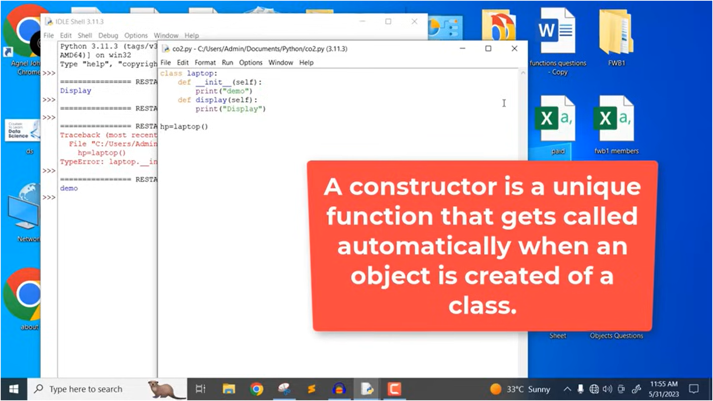

'Constructor': A constructor is a unique function that gets called automatically when an object is created of a class.
__init__- inbuild constructor in PYTHON 

"""     "self" -  keyword is used to mention the current object of the class
class laptop:
    def __init__(self):
        self.price = 0
        self.processor =""
    def printdis(self):
        print(self.price)
        print(self.processor)

hp= laptop()
hp.price = 15000
hp.processor = "i5"

here in this code, the current object is "hp" so "self = hp"
        """

"""     how to create a empty class

class kamal:
    pass

    """